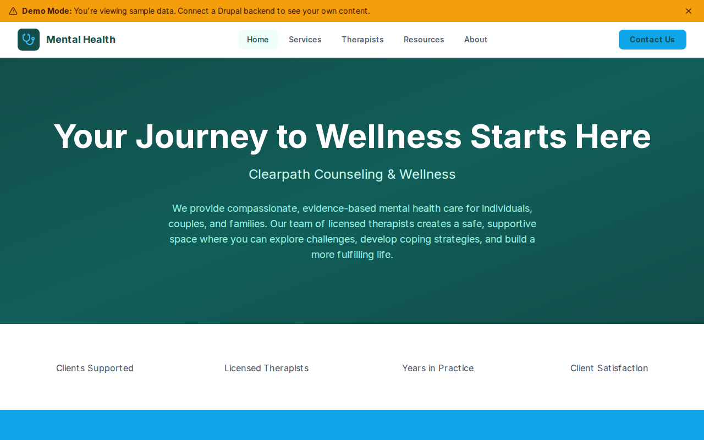

# Decoupled Mental Health

A mental health practice website starter template for Decoupled Drupal + Next.js. Built for therapy practices, counseling centers, psychiatric clinics, and wellness organizations that need to showcase services, therapist profiles, and educational resources for clients.



## Features

- **Therapy Services** - Detail services offered with session format, duration, age groups, and insurance info
- **Therapist Profiles** - Licensed therapist bios with credentials, specialties, therapeutic approaches, and availability
- **Mental Health Resources** - Educational articles on anxiety, depression, stress management, and more
- **Homepage** - Welcoming hero section with practice statistics, featured services, and consultation CTA
- **Static Pages** - About, insurance & fees, and other informational pages
- **Modern Design** - Warm, accessible UI optimized for healthcare and wellness content

## Quick Start

### 1. Clone the template

```bash
npx degit nextagencyio/decoupled-mental-health my-practice
cd my-practice
npm install
```

### 2. Run interactive setup

```bash
npm run setup
```

This interactive script will:
- Authenticate with Decoupled.io (opens browser)
- Create a new Drupal space
- Wait for provisioning (~90 seconds)
- Configure your `.env.local` file
- Import sample content

### 3. Start development

```bash
npm run dev
```

Visit [http://localhost:3000](http://localhost:3000)

---

## Manual Setup

If you prefer to run each step manually:

<details>
<summary>Click to expand manual setup steps</summary>

### Authenticate with Decoupled.io

```bash
npx decoupled-cli@latest auth login
```

### Create a Drupal space

```bash
npx decoupled-cli@latest spaces create "My Practice"
```

Note the space ID returned (e.g., `Space ID: 1234`). Wait ~90 seconds for provisioning.

### Configure environment

```bash
npx decoupled-cli@latest spaces env 1234 --write .env.local
```

### Import content

```bash
npm run setup-content
```

This imports:
- Homepage with hero image, statistics, and CTAs
- 3 Services (Individual Therapy, Couples Therapy, Child & Adolescent Therapy)
- 3 Therapists with credentials, specialties, and photos
- 3 Mental Health Resources (anxiety, depression, stress management articles)
- 2 Static Pages (About, Insurance & Fees)

</details>

## Content Types

### Service
- Title, Body (detailed description)
- Service Image, Summary
- Session Format, Session Duration
- Age Group, Insurance Accepted (boolean)
- Service Category (taxonomy: Individual, Couples, Family, Group, etc.)

### Therapist
- Title (name), Body (bio)
- Portrait Photo
- Credentials, License Number
- Specialties (list), Therapeutic Approaches (list)
- Education, Languages Spoken (list)
- Accepting New Clients (boolean)
- Role (taxonomy: Licensed Psychologist, LCSW, LPC, etc.)

### Resource
- Title, Body (article content)
- Featured Image, Summary
- Topic (taxonomy: Anxiety, Depression, Relationships, Self-Care, etc.)
- Author Name, Published Date

### Homepage
- Hero Title, Subtitle, Description, Hero Image
- Statistics (paragraph items with number and label)
- Featured Items Title
- CTA Title, Description, Primary and Secondary buttons

## Customization

### Colors & Branding
Edit `tailwind.config.js` to customize colors, fonts, and spacing.

### Content Structure
Modify `data/mental-health-content.json` to add or change content types and sample content.

### Components
React components are in `app/components/`. Update them to match your design needs.

## Demo Mode

Demo mode allows you to showcase the application without connecting to a Drupal backend. It displays mock content for the homepage, services, therapists, and resources.

### Enable Demo Mode

Set the environment variable:

```bash
NEXT_PUBLIC_DEMO_MODE=true
```

Or add to `.env.local`:
```
NEXT_PUBLIC_DEMO_MODE=true
```

### What Demo Mode Does

- Shows a "Demo Mode" banner at the top of the page
- Returns mock data for all GraphQL queries
- Displays sample services, therapist profiles, and mental health resources
- No Drupal backend required

### Removing Demo Mode

To convert to a production app with real data:

1. Delete `lib/demo-mode.ts`
2. Delete `data/mock/` directory
3. Delete `app/components/DemoModeBanner.tsx`
4. Remove `DemoModeBanner` from `app/layout.tsx`
5. Remove demo mode checks from `app/api/graphql/route.ts`

## Deployment

### Vercel (Recommended)
[](https://vercel.com/new/clone?repository-url=https://github.com/nextagencyio/decoupled-mental-health)

Set `NEXT_PUBLIC_DEMO_MODE=true` in Vercel environment variables for a demo deployment.

### Other Platforms
Works with any Node.js hosting platform that supports Next.js.

## Documentation

- [Decoupled.io Docs](https://www.decoupled.io/docs)
- [Next.js Documentation](https://nextjs.org/docs)
- [Drupal GraphQL](https://www.decoupled.io/docs/graphql)

## License

MIT
